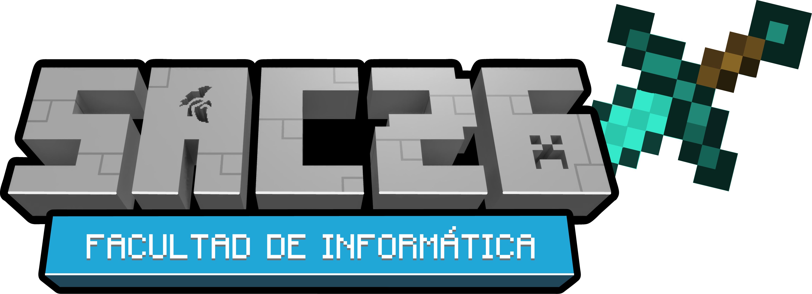

<div align="center">

  
  

### Team Project — Git & GitHub Course

[](https://developer.mozilla.org/en-US/docs/Web/HTML)
[](https://developer.mozilla.org/en-US/docs/Web/CSS)
[](https://developer.mozilla.org/en-US/docs/Web/JavaScript)
[](https://git-scm.com/)
[](https://github.com/)

---

Welcome to the collaborative course project. Here you'll practice the full team workflow with Git and GitHub by creating your personal page with an 8-bit avatar and adding it to the team gallery.

</div>

---

## Table of Contents

- [Objective](#objective)
- [Before You Begin](#before-you-begin--read-this)
- [Step-by-Step Instructions](#step-by-step-instructions)
- [Project Structure](#project-structure)
- [Common Errors](#common-errors)
- [Useful Resources](#useful-resources)

---

## Objective

Create your **personal HTML page** with an 8-bit avatar and add it to the team gallery. At the end, we'll have a published website where each team member has their own page.

---

## Before You Begin — Read This

This project is designed so that **there are NO merge conflicts** if you follow the instructions. The key is:

| YOU SHOULD | YOU SHOULD NOT |
|---|---|
| Copy the HTML template and rename it | Edit the content inside the HTML |
| Add **your line** in `js/team.js` | Modify your teammates' lines |
| Create your avatar in the builder | Edit `index.html`, `avatars.js`, or `profile-loader.js` |

> **Why?** All your information (name, avatar, skills, etc.) is loaded **automatically** from `js/team.js`. The HTML is just an empty template that the system fills in for you.

Before creating branches or making commits, read the [CONVENTIONS.md](CONVENTIONS.md) file to learn the correct formats for branch names and commit messages.

---

## Step-by-Step Instructions

### Step 1 — Clone the Repository

Open your terminal and clone the repository:

```bash
git clone <REPOSITORY_URL>
cd Teamwork
```

> Your instructor will give you the URL. Example: `https://github.com/dferram/Teamwork.git`

### Step 2 — Create Your Branch

Create a branch following the conventions format (`feature/page-firstname-lastname`):

```bash
git checkout -b feature/page-firstname-lastname
```

**Example:**
```bash
git checkout -b feature/page-john-doe
```

> **IMPORTANT:** Never work directly on `main`. Always create your own branch. See [CONVENTIONS.md](CONVENTIONS.md) for all available prefixes.

### Step 3 — Create Your HTML File

Copy the template and rename it with your name. **DO NOT edit the HTML content.**

**On Windows (PowerShell):**
```powershell
Copy-Item pages\_plantilla.html pages\firstname-lastname.html
```

**On Mac/Linux:**
```bash
cp pages/_plantilla.html pages/firstname-lastname.html
```

**Example:** If your name is John Doe:
```powershell
Copy-Item pages\_plantilla.html pages\john-doe.html
```

#### What do I do with the HTML?

| YES | NO |
|---|---|
| Copy the template and rename it | Write your name inside the HTML |
| (Optional) change the `<title>` to your name | Add content, skills, or avatar directly in the HTML |
| Verify the file exists in `pages/` | Delete the instruction comment from the HTML |

> **Why can't I edit the HTML?** Because the system loads your information automatically from `js/team.js`. This eliminates Git conflicts.

### Step 4 — Create Your 8-Bit Avatar

1. Open `avatar-builder.html` by double-clicking it (opens in your browser)
2. **Choose a method:**
   - **Option A — Preset:** Click on an avatar from the gallery (steve, alex, zombie, creeper, etc.)
   - **Option B — Draw:** Select a color from the palette and paint on the 8x8 grid
3. **Customize** the colors if you want (optional)
4. **Copy the code** shown in the "YOUR CODE" section — click **COPY**

The code looks like this:
```
5555555555555555115555111615516116655661511551155555555555555555
```

> **Tip:** Save the code in a notepad in case you need it later.

### Step 5 — Register Your Data in `team.js`

**THIS IS THE MOST IMPORTANT STEP.** This is where ALL your information goes.

#### 5.1 — Open the file `js/team.js`

#### 5.2 — Find this comment:
```js
// --- ADD YOUR LINE BELOW HERE ---
```

#### 5.3 — Add your object BELOW that comment

Copy this template, paste it below the comment, and modify each field with your data:

```js
{
    name: "Your Full Name",
    page: "pages/firstname-lastname.html",
    tagline: "A short phrase about you",
    avatar: "PASTE_YOUR_BUILDER_CODE_HERE",
    github: "https://github.com/your-username",
    about: "A paragraph about you. Talk about your interests, experience, or whatever you'd like to share.",
    skills: ["HTML", "CSS", "JavaScript", "Git"],
    randomFact: "A fun or curious fact about you",
    biome: "forest"
},
```

#### 5.4 — Guide for each field

| Field | Required? | What to put | Example |
|---|---|---|---|
| `name` | Yes | Your full name | `"John Doe"` |
| `page` | Yes | Path to your HTML (must match the file from step 3) | `"pages/john-doe.html"` |
| `tagline` | Yes | A short phrase (max. 50 characters) | `"Code, coffee, repeat"` |
| `avatar` | Yes | The code you copied from the builder (step 4) | `"5555555555555555..."` |
| `github` | Yes | Your GitHub profile URL. The system will automatically fetch your stats (total contributions, streak, followers, and badges) via the official API. | `"https://github.com/johndoe"` |
| `about` | Yes | A paragraph about you (interests, experience, or whatever you'd like to share). | `"I'm an engineering student..."` |
| `skills` | Yes | List of technical skills (min. 3). | `["Python", "React", "Git"]` |
| `randomFact` | Yes | A fun or curious fact about you. | `"I can solve a Rubik's Cube in 2 min"` |
| `biome` | Yes | The visual background for your page. Options: `forest`, `desert`, `jungle`, `taiga`, `plains`, `nether`, `end`, `night`. | `"night"` |

#### 5.5 — Checks BEFORE saving

- [ ] Does your object end with `},` (comma after the closing brace)?
- [ ] Does the `page` value match EXACTLY with the name of your HTML file?
- [ ] Are all text values inside quotes `""`?
- [ ] Does the `skills` array use brackets `[]` and quotes `""` for each skill?
- [ ] Did you NOT modify any of your teammates' lines?

> **THE TRAILING COMMA IS MANDATORY.** Without it, the code fails for everyone:
> ```js
> },  // <-- This comma is MANDATORY
> ```

#### Rules to avoid merge conflicts

1. **Edit ONLY your line** — never touch anyone else's lines
2. **Add your object at the bottom** — right below the `ADD YOUR LINE BELOW HERE` comment
3. **Don't delete the guide comment** — leave it for others
4. **Don't reformat the file** — don't change spaces, tabs, or blank lines that already exist

---

### Step 6 — Verify Locally (Recommended)

Before pushing your changes, verify everything works:

**Option A — VS Code (easiest):**
- Install the "Live Server" extension
- Right-click on `index.html` -> "Open with Live Server"

**Option B — Python:**
```bash
python -m http.server 8000
```

**Option C — Node.js:**
```bash
npx http-server -p 8000
```

Then open `http://localhost:8000` and verify:
- [ ] Your card appears in the gallery
- [ ] Your avatar looks correct
- [ ] Clicking on your card loads your personal page correctly
- [ ] Your name, about, skills, and random fact display correctly

> If something doesn't work, open the browser console (F12) and check for errors. The most common issue is a missing comma in `team.js`.

---

### Step 7 — Commit and Push

Save your changes and upload them to GitHub using the conventional commit format:

```bash
git add .
git commit -m "feat: add page for firstname-lastname"
git push origin feature/page-firstname-lastname
```

**Example:**
```bash
git add .
git commit -m "feat: add page for john-doe"
git push origin feature/page-john-doe
```

> Use the same branch name you created in step 2. See [CONVENTIONS.md](CONVENTIONS.md) for more commit formats.

---

### Step 8 — Create a Pull Request

1. Go to the repository on GitHub
2. You'll see a yellow banner to create a Pull Request from your branch
3. Click **"Compare & pull request"**
4. Write a descriptive title (example: `feat: add page for John Doe`)
5. Click **"Create pull request"**

---

### Step 9 — Resolve Merge Conflicts (if any)

If GitHub indicates there are conflicts, follow these steps:

#### 9.1 — Update your branch with the latest changes from main:
```bash
git checkout main
git pull origin main
git checkout feature/page-firstname-lastname
git merge main
```

#### 9.2 — Resolve the conflict in `team.js`

Git will mark the conflict like this:
```
<<<<<<< HEAD
    { name: "Your Name", ... },
=======
    { name: "Another Teammate", ... },
>>>>>>> main
```

**The solution is simple:** keep BOTH lines and remove the conflict markers:
```js
    { name: "Another Teammate", ... },
    { name: "Your Name", ... },
```

#### 9.3 — Push the resolution:
```bash
git add .
git commit -m "merge: resolve conflicts in team.js"
git push origin feature/page-firstname-lastname
```

> **How do I identify conflict markers?** Look for `<<<<<<<`, `=======`, and `>>>>>>>` in the file. Everything between those markers is the conflict. You must delete all 3 marker lines and keep the content from both sides.

---

### Step 10 — Mission Complete

Once your PR is approved and merged, your page and avatar will appear in the gallery automatically.

---

## Project Structure

```text
Teamwork/
|-- index.html              <- Main page (automatic gallery) — DO NOT EDIT
|-- avatar-builder.html     <- Interactive avatar editor — DO NOT EDIT
|-- README.md               <- This file
|-- CONVENTIONS.md          <- Branch and commit conventions guide
|
|-- css/
|   |-- styles.css          <- Shared styles — DO NOT EDIT
|
|-- js/
|   |-- avatars.js          <- Pixel avatar system — DO NOT EDIT
|   |-- team.js             <- [EDIT YOUR DATA HERE] (your line only)
|   |-- profile-loader.js   <- Automatic data loader — DO NOT EDIT
|
|-- pages/
    |-- _plantilla.html     <- Base template (copy and rename it)
    |-- FernandoRamirez.html<- Example of a finished page
    |-- your-name.html      <- [YOUR PAGE] (the one you create in step 3)
```

### Files YOU touch:

| File | Action |
|---|---|
| `pages/firstname-lastname.html` | Create it by copying `_plantilla.html` |
| `js/team.js` | Add your object with your data (one new entry) |

### Files you should NOT touch:

| File | Reason |
|---|---|
| `index.html` | Generated automatically from `team.js` |
| `avatar-builder.html` | It's just a tool, not to be modified |
| `css/styles.css` | Shared team styles |
| `js/avatars.js` | Avatar rendering engine |
| `js/profile-loader.js` | Automatic profile loader |

---

## Common Errors

| Error | Cause | Solution |
|---|---|---|
| My card doesn't appear in the gallery | You didn't add your object in `team.js` | Review step 5 |
| My page appears blank | The `page` field doesn't match your HTML file | Verify the name is identical |
| JavaScript error in console | Missing `,` at the end of your object | Add `},` at the end |
| Merge conflict when making a PR | A teammate edited `team.js` before you | Follow step 9 |
| My avatar doesn't show | The avatar code was copied incorrectly | Regenerate the avatar in the builder |

---

## Useful Resources

- [CONVENTIONS.md](CONVENTIONS.md) — Branch and commit formats for this project
- [Git Cheat Sheet](https://education.github.com/git-cheat-sheet-education.pdf)
- [How to resolve merge conflicts](https://docs.github.com/en/pull-requests/collaborating-with-pull-requests/addressing-merge-conflicts)
- [Markdown Guide](https://guides.github.com/features/mastering-markdown/)
- [GitHub Pages](https://pages.github.com/)

---

> Have questions? Ask the instructor or open an **Issue** in the repository.
